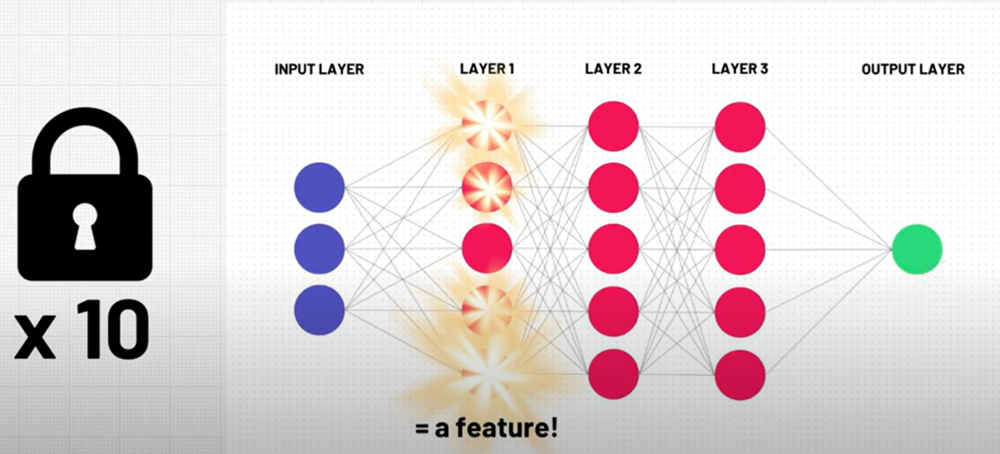
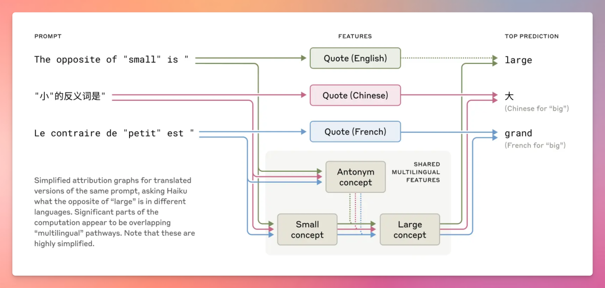

<!-- _class: title -->
<!-- _class: summary-->

# Tracing the thoughts of an LLM

**Vinod**
*Generative AI Expert*

---
<!-- _class: summary-->

## How does a Large Language Model produce one token?

---
<!-- _class: picture-->

---
<!-- _class: picture-->

---
<!-- _class: two-columns-centered -->
## Language model neurons are polysemantic

---

<!--_class: two-columns-centered-->

## But combination of neurons can be interpretable

---

<!-- _class: two-columns-centered -->

## Feature : Golden Gate Bridge

---
<!-- _class: picture-->

---
<!-- _class: two-columns-centered -->
## Influence on Behavior

---
<!-- _class: picture-->

---
<!-- _class: picture-->

---
<!-- _class: normal-slide -->
### Abstract Features
- Sycophantic phrase
- Secrecy
- Code error
- Bias
- Deception
- Power-seeking
- Criminal
- ...  

---
<!-- _class: picture-->

---
<!-- _class: picture-->
# LLM: What’s Misunderstood vs. What’s True

---

<!-- _class: two-columns-centered -->

## Misconception #1: LLM Simply Predicts the Next Word

---
<!-- _class: picture-->

---
<!-- _class: two-columns-centered -->

## Reality: LLMs Plans Ahead 

---

<!-- _class: two-columns-centered -->

## Misconception #2: LLM Processes Different Languages Separately

---

<!-- _class: picture-->

---

<!-- _class: two-columns-centered -->

## Reality: LLMs Uses Universal Concepts

---

<!-- _class: two-columns-centered -->

## Misconception #3: LLM Reasoning Matches its Explanations

---

<!-- _class: picture-->

---
<!-- _class: picture-->

---
<!-- _class: two-columns-centered -->

## Reality: LLMs Internal Process Differs from its Explanations 

---

<!-- _class: two-columns-centered -->

## Misconception #4: LLMs Just Memorize Answers

---
<!-- _class: picture-->

---

<!-- _class: two-columns-centered -->

## Reality: LLMs Uses Multi-Step Reasoning

---

<!-- _class: two-columns-centered -->

## Misconception #5: Hallucinations and Jailbreaks are Random Failures

---
<!-- _class: picture-->

---
<!-- _class: picture-->

---

<!-- _class: two-columns-centered -->

## Reality: They’re the Result of Specific, Understandable Mechanisms

---
### How Researchers Proved These Findings

- **Attribution Graphs** : Mapping computational pathways in Claude’s reasoning processes by grouping related neural features into interpretable steps.

- **Intervention Experiments**:  Measuring output changes when specific features were inhibited or activated.

- **Cross-layer Transcoders**: Decomposing neural activity into sparse features to link concepts across model layers.

Read the full paper: https://transformer-circuits.pub/2025/attribution-graphs/biology.html

---
# Final Thought

- Interpretable features in LLMs are **highly abstract** and capable of **influencing large models**.

- LLMs can **plan ahead**, **navigate meaning across languages**, and sometimes **generate explanations that diverge from their actual reasoning**.

- Understanding LLM is **foundational for safety, trust, and impactful applications**.

---

<!-- _class: quote-->

> People understand very little about how LLMs actually work, so they still think LLMs are very different from us. But actually, it's very important for people to understand that they're very like us.

---
## References

1. [Scaling Monosemanticity: Extracting Interpretable Features from Claude 3 Sonnet](https://transformer-circuits.pub/2024/scaling-monosemanticity/index.html)
2. [Mapping the Mind of a Large Language Model \ Anthropic](https://www.anthropic.com/research/mapping-mind-language-model)
3. [Tracing the thoughts of a LLM](https://www.anthropic.com/news/tracing-thoughts-language-model)
4. [Mechanistic Interpretability: A Look Inside an AI's Mind + The Latest AI Research from Anthropic](https://www.youtube.com/watch?v=Y5l6VD9s4Lw)
5. [Mechanistic Interpretability explained | Chris Olah and Lex Fridman](https://www.youtube.com/watch?v=riniamTdUSo)
6. [Inside the Mind of Claude: How Large Language Models Actually "Think"](https://blog.typingmind.com/ai-misconceptions/)
